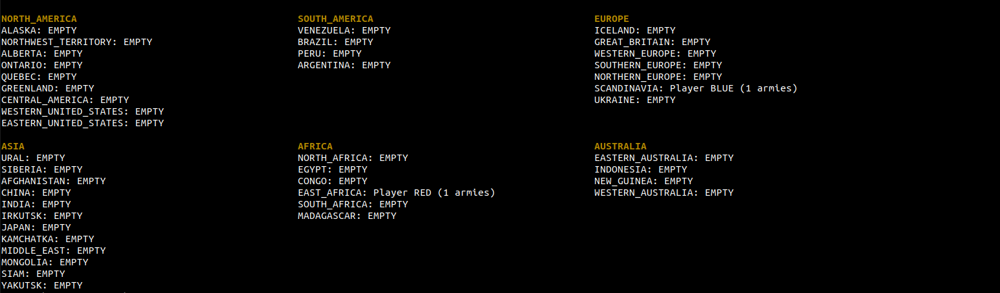
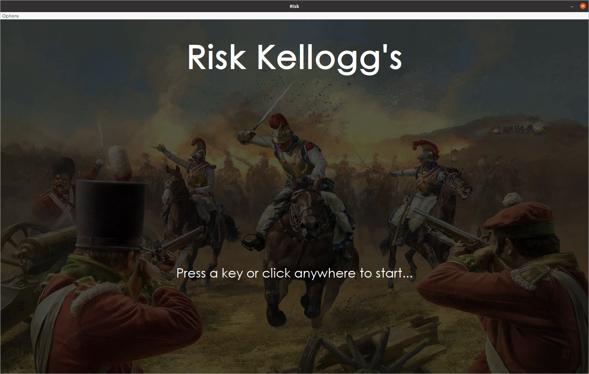
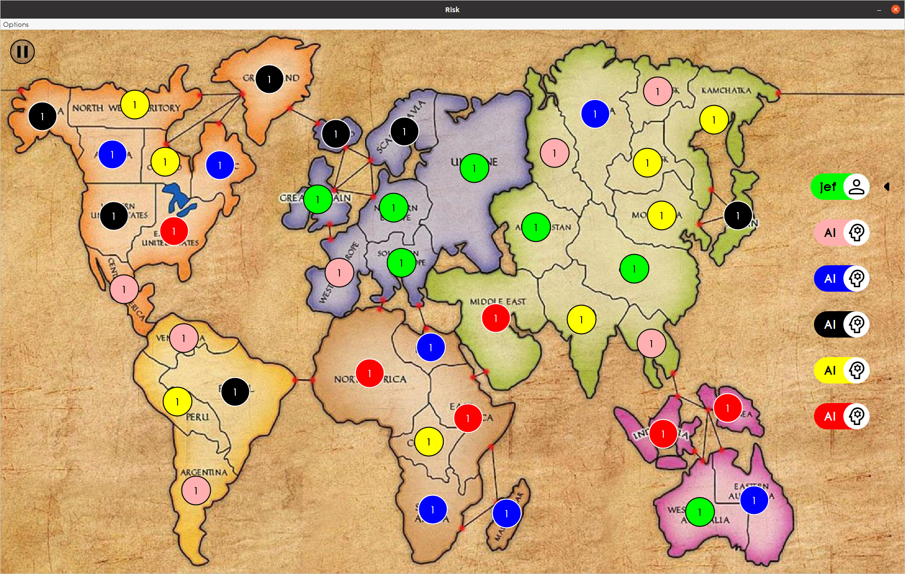
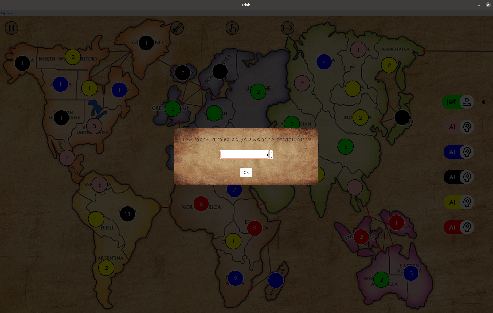
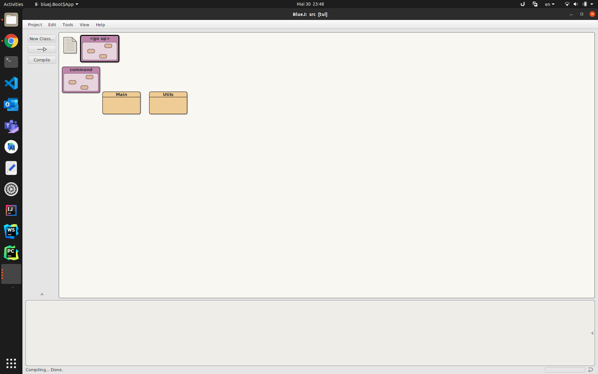
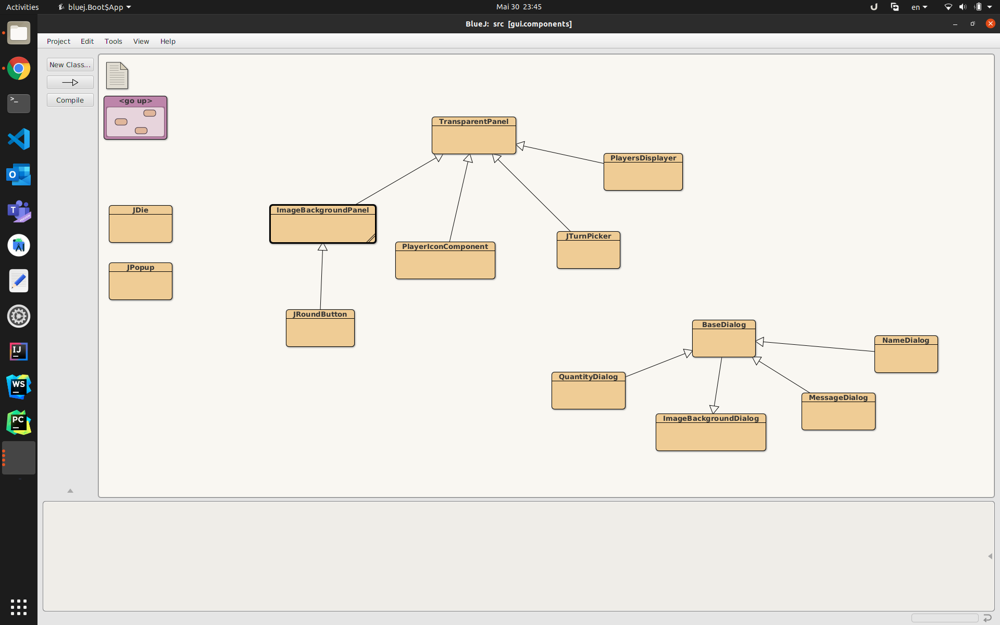
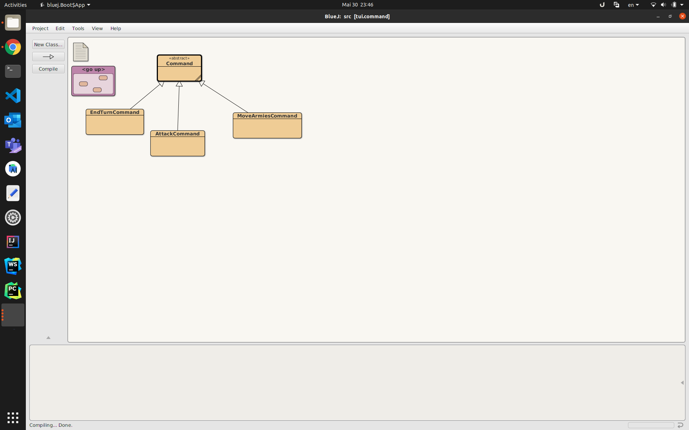
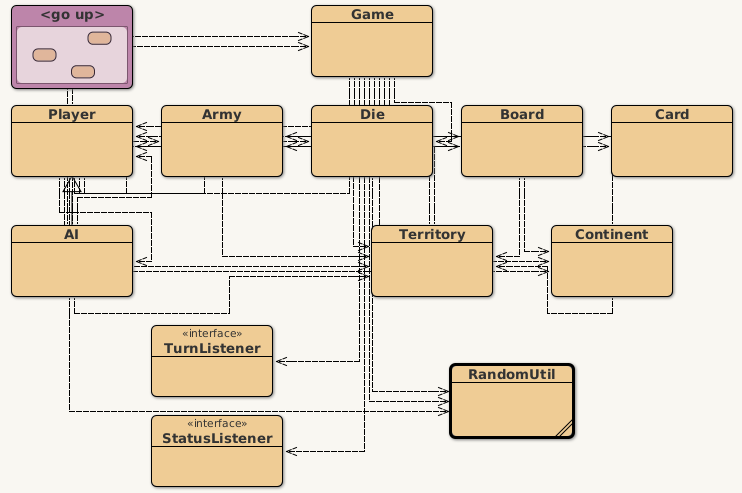

# Project Risk Kellogg's

Risk Kellogg's is a Risk-based game, in which the goal is to conquer the whole world!
The game starts with the players placing armies in different countries, that will lead to the main phase: fight your opponents and reorganize your armies across the (flat) globe.

## Instructions

### GUI
Enter your name, place armies all around the world and start attacking your opponents.
During your turn you can attack, move armies or end your turn! 
Click on the UI buttons on the top of the screen to choose what to do.
If you decide to take the risk of attacking, after clicking on the country you want to attack from, just click the country you want to attack! Easy peasy!
On the other hand, if you decide to be weak and just move some armies, do the same instructions as before...
End your turn once you are satisfied!

## Contributors

* Jeferson Morales Mariciano (moralj@usi.ch), JekxDevil
* Michele Dalle Rive (dallem@usi.ch), micheledallerive

## Project Structure

This project is both a Maven project and a BlueJ project.
You can open, compile, test, and run the code within BlueJ
by opening `src/package.bluej`.

You can use Maven to compile, test, and check the code
by running `mvn` in this top-level directory (see below).

You can run the code compiled by Maven from the terminal (see below).

The code is structured into three packages:

* `model` - all the model classes and their tests
* `tui` - text user interface (works in a terminal)
* `gui` - Swing-based graphical user interface (opens a window)

Note that the classes in the `model` package MUST NOT refer to any
classes in the `tui` or `gui` packages.

The classes in the `tui` package must not refer to any classes in the `gui` package.

The classes in the `gui` package must not refer to any classes in the `tui` package.

The classes in the `tui` and `gui` packages SHOULD refer to classes in the `model` package.

The classes in the `model` package need to come with unit tests.
(The classes in the `tui` and `gui` packages do not need to be covered with tests.)

## Screenshots

### TUI


### GUI




### Bluej





## How build using Maven

In this top-level directory:

```bash
mvn compile
```

## How to run the application

To run the application from outside BlueJ, first build it with Maven.
This generates the compiled classes in the directory `target/classes`.

### Running the TUI

To run this application, with the TUI, from the command line:

```bash
java -cp target/classes tui.Main
```

### Running the GUI

To run this application, with the GUI, from the command line:

```bash
java -cp target/classes gui.Main
```

### How run the JUnit tests with Maven

```bash
mvn test
```

### How to run Checkstyle with Maven

```bash
mvn compile
mvn checkstyle:check
```

### How to run PMD with Maven

```bash
mvn compile
mvn pmd:check
```

### How to run PMD's CPD with Maven

```bash
mvn compile
mvn pmd:cpd-check
```

### How to determine test coverage with Maven

```bash
mvn site
```

Then open `target/site/index.html` and find the JaCoCo report.
